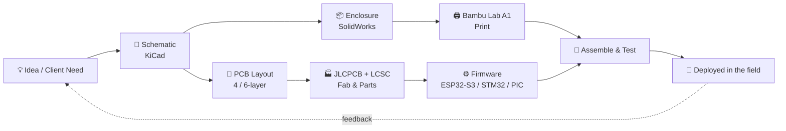
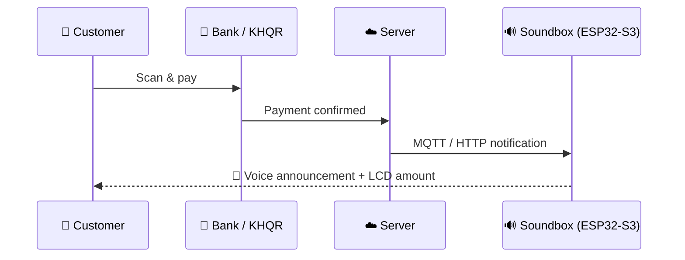
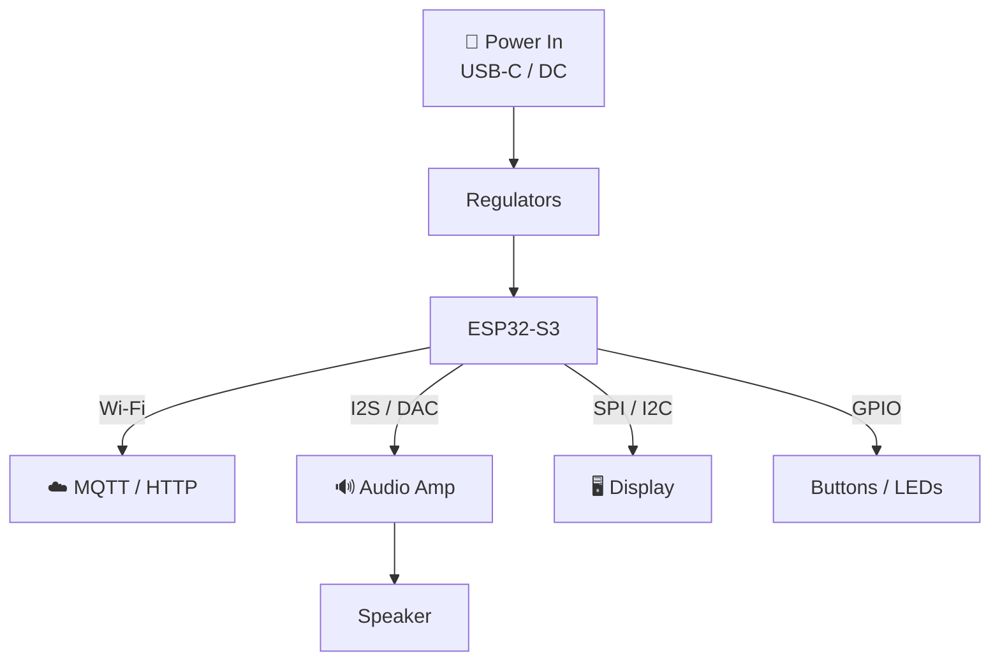

<div align="center">

  <!-- Dynamic Waving Header Banner -->
  

  <!-- Animated Typing SVG -->
  <a href="https://git.io/typing-svg">
    
  </a>

  <p align="center">
    📍 <b>Phnom Penh, Cambodia 🇰🇭</b> | 🎓 <b>B.S. Telecommunication & Electronic Engineering (RUPP)</b>
  </p>

  <p align="center">
    <a href="https://github.com/CHHUNLONGKH?tab=followers">
      
    </a>
    
    
    
  </p>

  <!-- Language switcher -->
  <p align="center">
    🌐 <b>English</b> | <a href="https://github.com/CHHUNLONGKH/CHHUNLONGKH/blob/main/README.km.md">ភាសាខ្មែរ</a>
  </p>

  <!-- Quick navigation -->
  <p align="center">
    <a href="#-workflow">Workflow</a> •
    <a href="#-featured-projects">Projects</a> •
    <a href="#-engineering-notebook">Notebook</a> •
    <a href="#-skill-map">Skills</a> •
    <a href="#-github-activity">Activity</a> •
    <a href="#-lets-build-something">Contact</a>
  </p>

</div>

---

# Hi there, I'm Chhun Long 👋

> **"I don't just design circuits, I take an idea all the way from schematic to a box on a shop counter."**

I'm an **R&D Engineer** building real hardware for real businesses in Cambodia: PCB, firmware, enclosure, and cloud connection, all in one loop. 🔁

<table>
<tr>
<td width="50%" valign="top">

### 🧭 Right now
- 🔭 **Building:** KHQR payment notification hardware, smart displays, custom ESP32-S3 IoT modules
- 🌱 **Learning:** tighter impedance control, RTOS patterns, faster prototype → production cycles
- 💬 **Ask me about:** KiCad 6-layer stackups, C/C++ firmware, SolidWorks, MQTT & HTTP APIs
- 📫 **Reach me:** [Telegram @CHHUNLONGKH](https://t.me/CHHUNLONGKH)

</td>
<td width="50%" valign="top">

### 🪪 Quick facts
- 🎓 B.S. Telecom & Electronic Eng. (RUPP)
- 📍 Phnom Penh, Cambodia 🇰🇭
- 🧰 Runs **EC STORE**, a tools & electronics shop
- 🎥 Shares builds on YouTube & TikTok
- 🖨️ Every enclosure is printed in-house on a Bambu Lab A1
- ☕ Fueled by coffee and solder fumes

</td>
</tr>
</table>

---

## 🔄 Workflow



---

## 🚀 Featured Projects

### 🔊 KHQR Smart Soundbox & Display
Instant audio + LCD feedback the moment a KHQR payment lands. Deployed with **Mr. Laundry** and **Easy Laundry**.



<details>
<summary><b>🧩 Device architecture (click to expand)</b></summary>



| | |
|---|---|
| **Hardware** | ESP32-S3, audio amp, LCD, custom PCB |
| **Connectivity** | MQTT · HTTP API · Wi-Fi |
| **Mechanical** | SolidWorks enclosure, 3D printed |

</details>

### 🔌 High-Density PCB Layouts
- 4-layer and 6-layer boards in **KiCad** with defined net classes
- Trace impedance tuning against **JLCPCB stackups**
- Component sourcing through **LCSC** for fast, low-cost production runs

### ⚙️ Firmware Across the MCU Spectrum

| MCU | Style | Typical use |
|---|---|---|
| **ESP32-S3** | RTOS + networking | IoT, displays, soundboxes |
| **STM32** | Low-level C/C++ | Control & peripherals |
| **PIC12F1822** | Tiny & efficient | Simple, cost-sensitive logic |

### ☀️ Solar Power Automation
Industrial **solar motor pump controllers** and inverter configuration for **380V, 10HP** systems, where hardware really has to be reliable.

---

## 📓 Engineering Notebook

Small, practical things I've learned building hardware. Click to expand.

<details>
<summary><b>✅ My pre-fab PCB checklist</b></summary>

- [ ] DRC and ERC clean, with no ignored warnings
- [ ] Net classes set (power, signal, high-speed) with correct widths and clearances
- [ ] Stackup matches the fab's real capabilities (JLCPCB layer stack and impedance table)
- [ ] Decoupling caps placed right at the MCU power pins
- [ ] Continuous ground reference under fast signals
- [ ] Antenna keep-out respected on ESP32 modules
- [ ] Every part checked against LCSC stock and footprint
- [ ] Silkscreen: polarity, pin 1, test points, and version number
- [ ] 3D view checked against the SolidWorks enclosure

</details>

<details>
<summary><b>💻 Firmware pattern I like for IoT (ESP32 + MQTT)</b></summary>

A minimal sketch of the idea: keep the callback tiny, and push work to a queue so audio and display tasks never block the network stack.

```cpp
#include <WiFi.h>
#include <PubSubClient.h>

QueueHandle_t paymentQueue;

void onMessage(char* topic, byte* payload, unsigned int len) {
  // Keep it short: copy and hand off, don't process here.
  char msg[64] = {0};
  memcpy(msg, payload, min(len, sizeof(msg) - 1));
  xQueueSend(paymentQueue, msg, 0);
}

void audioTask(void*) {
  char msg[64];
  for (;;) {
    if (xQueueReceive(paymentQueue, msg, portMAX_DELAY)) {
      // parse amount -> update LCD -> play voice clips
    }
  }
}
```

</details>

<details>
<summary><b>🖨️ Print-to-fit enclosure tips</b></summary>

- Print a fast test fit before finalizing the design
- Add 0.2 to 0.3 mm clearance for snap-fits and PCB slots
- Model screw bosses from the actual PCB hole positions (export from KiCad)
- Keep speaker grilles and antenna areas free of thick walls

</details>

---

## 🎯 Skill Map

| Area | Level |
|---|---|
| PCB Design (KiCad) |  |
| Embedded C/C++ |  |
| IoT Protocols (MQTT/HTTP) |  |
| 3D CAD (SolidWorks) |  |
| Additive Manufacturing |  |
| Power / Solar Automation |  |

### 🛠️ Hardware & Technical Stack

**PCB & CAD / 3D Modeling**


**Firmware & Languages**


**Microcontrollers & Hardware**


**Communication Protocols & Tools**


---

## 🧭 Roadmap

- [x] KHQR soundbox deployed to real shops
- [x] 6-layer KiCad boards in production via JLCPCB
- [ ] Open-source a reference KHQR soundbox design
- [ ] OTA firmware updates across all devices
- [ ] Battery + low-power soundbox variant
- [ ] More build videos on YouTube & TikTok

<sub>Edit this list to match your real plans.</sub>

---

## 📊 GitHub Activity

<div align="center">
  
  
</div>

<br />

<div align="center">
  
</div>

<br />

<div align="center">
  
</div>

<br />

<div align="center">
  
</div>

<br />

<!-- Contribution snake: needs the workflow in .github/workflows/snake.yml (repo must be CHHUNLONGKH/CHHUNLONGKH) -->
<div align="center">
  <picture>
    <source media="(prefers-color-scheme: dark)" srcset="https://raw.githubusercontent.com/CHHUNLONGKH/CHHUNLONGKH/output/github-snake-dark.svg" />
    <source media="(prefers-color-scheme: light)" srcset="https://raw.githubusercontent.com/CHHUNLONGKH/CHHUNLONGKH/output/github-snake.svg" />
    
  </picture>
</div>

<!-- Pinned repo cards: uncomment and put in your real repo names
<div align="center">
  <a href="https://github.com/CHHUNLONGKH/REPO_NAME"></a>
</div>
-->

---

## 🤝 Let's Build Something

Got an IoT idea, a payment device, a custom PCB, or a controller that needs to survive real-world conditions? Message me on Telegram. Let's turn it into hardware. ⚡

<div align="center">

[](https://t.me/CHHUNLONGKH)

</div>

## 🌐 Connect & Follow

<div align="center">

[](https://t.me/CHHUNLONGKH)
[](https://grabcad.com/chhun.long.chay-1)
[](https://www.facebook.com/Chhunlongkh44)
[](https://www.facebook.com/ECSTORE.TOOLS/)
[](https://www.tiktok.com/@chhunlongkh?lang=en)
[](https://www.youtube.com/channel/UCtKbRAz7CkX35r7EZQbLT5w)
[](https://chhunlonchay44.blogspot.com/)

</div>

---

<div align="center">
  
  <br /><br />
  
  <br />
  <sub>⚡ Made with solder fumes, coffee, and a lot of prototypes ⚡</sub>
</div>


