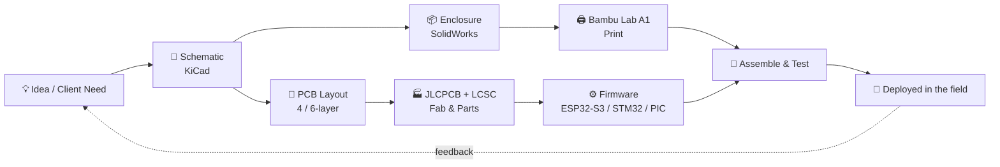
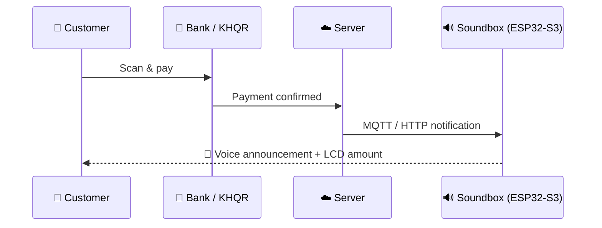
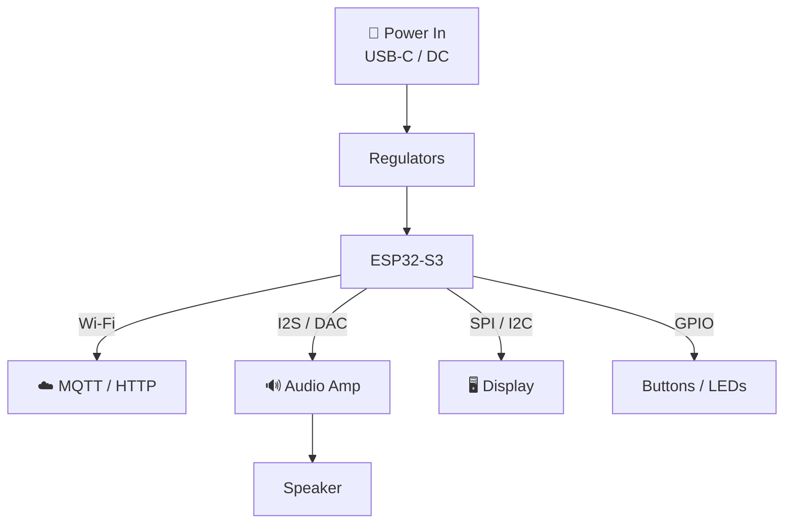

<div align="center">

  <!-- Dynamic Waving Header Banner -->
  

  <!-- Animated Typing SVG -->
  <a href="https://git.io/typing-svg">
    
  </a>

  <p align="center">
    📍 <b>Phnom Penh, Cambodia</b> | 🎓 <b>B.S. Telecommunication & Electronic Engineering (RUPP)</b>
  </p>

  <p align="center">
    <a href="https://github.com/CHHUNLONGKH?tab=followers">
      
    </a>
    
    
    
  </p>

  <!-- Language hint -->
  <p align="center">
    🌐 <b>English</b> below &nbsp;|&nbsp; <b>ភាសាខ្មែរ</b>៖ ចុចប្រអប់ខាងក្រោម ⬇️
  </p>

  <!-- Quick navigation -->
  <p align="center">
    <a href="#-workflow">Workflow</a> •
    <a href="#-featured-projects">Projects</a> •
    <a href="#-engineering-notebook">Notebook</a> •
    <a href="#-skill-map">Skills</a> •
    <a href="#-github-activity">Activity</a> •
    <a href="#-lets-build-something">Contact</a>
  </p>

</div>

---

<details>
<summary><b>ភាសាខ្មែរ &nbsp;—&nbsp; ចុចទីនេះដើម្បីអាន (Read in Khmer)</b></summary>

# សួស្តី! ខ្ញុំឈ្មោះ ឈុន ឡុង 👋

> **«ខ្ញុំមិនត្រឹមតែរចនាសៀគ្វីប៉ុណ្ណោះទេ ខ្ញុំនាំគំនិតមួយពី schematic រហូតដល់ប្រអប់ផលិតផលដែលដាក់លើតុលក់ទំនិញ។»**

ខ្ញុំជាវិស្វករ **R&D** ដែលបង្កើតផ្នែករឹង (hardware) ពិតប្រាកដសម្រាប់អាជីវកម្មពិតៗនៅកម្ពុជា៖ PCB, firmware, ប្រអប់ការពារ (enclosure) និងការតភ្ជាប់ទៅ cloud ទាំងអស់នៅក្នុងវដ្តការងារតែមួយ។ 🔁

<table>
<tr>
<td width="50%" valign="top">

### 🧭 បច្ចុប្បន្ន
- 🔭 **កំពុងបង្កើត៖** ឧបករណ៍ជូនដំណឹងការទូទាត់ KHQR, ប្រព័ន្ធបង្ហាញអេក្រង់ឆ្លាតវៃ និងម៉ូឌុល IoT ផ្ទាល់ខ្លួនលើ ESP32-S3
- 🌱 **កំពុងរៀន៖** ការគ្រប់គ្រង impedance ឲ្យតឹងរ៉ឹងជាងមុន, គំរូ RTOS និងការបង្កើនល្បឿនពី prototype ទៅផលិតកម្ម
- 💬 **សួរខ្ញុំអំពី៖** KiCad 6-layer stackup, C/C++ firmware, SolidWorks, MQTT និង HTTP API
- 📫 **ទាក់ទង៖** [Telegram @CHHUNLONGKH](https://t.me/CHHUNLONGKH)

</td>
<td width="50%" valign="top">

### 🪪 ព័ត៌មានរហ័ស
- 🎓 បរិញ្ញាបត្រវិស្វកម្មទូរគមនាគមន៍ និងអេឡិចត្រូនិច (RUPP)
- 📍 ភ្នំពេញ កម្ពុជា
- 🧰 គ្រប់គ្រងហាង **EC STORE** លក់ឧបករណ៍ និងគ្រឿងអេឡិចត្រូនិច
- 🎥 ចែករំលែកការបង្កើតនៅលើ YouTube និង TikTok
- 🖨️ ប្រអប់ (enclosure) ទាំងអស់បោះពុម្ពផ្ទាល់ខ្លួនដោយ Bambu Lab A1
- ☕ ថាមពលពីកាហ្វេ និងផ្សែងសំណប៉ាហាំង

</td>
</tr>
</table>

---

<a id="workflow"></a>
## 🔄 ដំណើរការការងារ៖ ពីគំនិតទៅផលិតផល



<sub>ដ្យាក្រាមប្រើពាក្យបច្ចេកទេសជាភាសាអង់គ្លេស ដើម្បីឲ្យត្រូវនឹងឧបករណ៍ដែលប្រើ។</sub>

---

<a id="projects"></a>
## 🚀 គម្រោងសំខាន់ៗ

### 🔊 KHQR Smart Soundbox និងអេក្រង់បង្ហាញ
ឧបករណ៍ផ្តល់សំឡេង និងអេក្រង់ LCD ភ្លាមៗនៅពេលមានការទូទាត់ KHQR ចូលមក។ ដាក់ឲ្យប្រើប្រាស់ជាមួយ **Mr. Laundry** និង **Easy Laundry**។



<details>
<summary><b>🧩 រចនាសម្ព័ន្ធឧបករណ៍ (ចុចដើម្បីពង្រីក)</b></summary>



| | |
|---|---|
| **ផ្នែករឹង** | ESP32-S3, audio amp, LCD, PCB ផ្ទាល់ខ្លួន |
| **ការតភ្ជាប់** | MQTT · HTTP API · Wi-Fi |
| **រូបរាងផ្នែកមេកានិច** | ប្រអប់ SolidWorks បោះពុម្ព 3D |

</details>

### 🔌 PCB ដង់ស៊ីតេខ្ពស់
- បន្ទះ 4-layer និង 6-layer ក្នុង **KiCad** ជាមួយ net class ដែលបានកំណត់ច្បាស់លាស់
- កែតម្រូវ impedance នៃ trace តាម **JLCPCB stackup**
- ស្វែងរកគ្រឿងបន្លាស់ពី **LCSC** សម្រាប់ផលិតកម្មលឿន និងថោក

### ⚙️ Firmware លើ MCU ច្រើនប្រភេទ

| MCU | របៀបសរសេរ | ការប្រើប្រាស់ទូទៅ |
|---|---|---|
| **ESP32-S3** | RTOS + បណ្តាញ | IoT, អេក្រង់, soundbox |
| **STM32** | C/C++ កម្រិតទាប | ការគ្រប់គ្រង និង peripheral |
| **PIC12F1822** | តូច និងសន្សំសំចៃ | តក្កវិជ្ជាសាមញ្ញ ថ្លៃទាប |

### ☀️ ស្វ័យប្រវត្តិកម្មថាមពលពន្លឺព្រះអាទិត្យ
ឧបករណ៍បញ្ជាម៉ូទ័របូមទឹកថាមពលពន្លឺព្រះអាទិត្យសម្រាប់ឧស្សាហកម្ម និងការកំណត់ inverter សម្រាប់ប្រព័ន្ធ **380V, 10HP** ដែលផ្នែករឹងត្រូវមានភាពជឿជាក់ខ្ពស់ពិតប្រាកដ។

---

<a id="notebook"></a>
## 📓 សៀវភៅកត់ត្រាវិស្វកម្ម

រឿងតូចៗ ប៉ុន្តែមានប្រយោជន៍ ដែលខ្ញុំបានរៀនពេលបង្កើតផ្នែករឹង។ ចុចដើម្បីពង្រីក។

<details>
<summary><b>✅ បញ្ជីត្រួតពិនិត្យ PCB មុនផលិត</b></summary>

- [ ] DRC និង ERC ស្អាត គ្មានការព្រមានដែលមិនអើពើ
- [ ] កំណត់ net class (power, signal, high-speed) ជាមួយទំហំ និងគម្លាតត្រឹមត្រូវ
- [ ] Stackup ត្រូវនឹងសមត្ថភាពពិតរបស់រោងចក្រ (តារាង layer stack និង impedance របស់ JLCPCB)
- [ ] Decoupling capacitor ដាក់ជិតជើងថាមពលរបស់ MCU
- [ ] មាន ground reference បន្តគ្នាក្រោមសញ្ញាល្បឿនលឿន
- [ ] គោរព antenna keep-out លើម៉ូឌុល ESP32
- [ ] ពិនិត្យគ្រប់គ្រឿងបន្លាស់ទល់នឹងស្តុក LCSC និង footprint
- [ ] Silkscreen៖ polarity, pin 1, test point និងលេខកំណែ
- [ ] ពិនិត្យ 3D view ជាមួយប្រអប់ SolidWorks

</details>

<details>
<summary><b>💻 គំរូ firmware ដែលខ្ញុំចូលចិត្តសម្រាប់ IoT (ESP32 + MQTT)</b></summary>

គំនិតសំខាន់៖ ធ្វើឲ្យ callback ខ្លីបំផុត ហើយបញ្ជូនការងារទៅ queue ដើម្បីកុំឲ្យ task សំឡេង និងអេក្រង់រារាំង network stack។

```cpp
#include <WiFi.h>
#include <PubSubClient.h>

QueueHandle_t paymentQueue;

void onMessage(char* topic, byte* payload, unsigned int len) {
  // Keep it short: copy and hand off, don't process here.
  char msg[64] = {0};
  memcpy(msg, payload, min(len, sizeof(msg) - 1));
  xQueueSend(paymentQueue, msg, 0);
}

void audioTask(void*) {
  char msg[64];
  for (;;) {
    if (xQueueReceive(paymentQueue, msg, portMAX_DELAY)) {
      // parse amount -> update LCD -> play voice clips
    }
  }
}
```

</details>

<details>
<summary><b>🖨️ គន្លឹះបោះពុម្ពប្រអប់ឲ្យសមល្អ</b></summary>

- បោះពុម្ពសាកល្បងលឿនៗមុនបញ្ចប់ការរចនា
- ដាក់គម្លាត 0.2 ដល់ 0.3 មម សម្រាប់ snap-fit និងរន្ធដាក់ PCB
- គូរ screw boss តាមទីតាំងរន្ធពិតរបស់ PCB (នាំចេញពី KiCad)
- កុំឲ្យជញ្ជាំងក្រាស់នៅកន្លែងដាក់ឧបករណ៍បំពងសំឡេង និងអង់តែន

</details>

---

<a id="skills"></a>
## 🎯 ផែនទីជំនាញ

| ផ្នែក | កម្រិត |
|---|---|
| រចនា PCB (KiCad) |  |
| Embedded C/C++ |  |
| ពិធីការ IoT (MQTT/HTTP) |  |
| 3D CAD (SolidWorks) |  |
| ការផលិតបែបបន្ថែមស្រទាប់ (3D Printing) |  |
| ស្វ័យប្រវត្តិកម្មថាមពល / ពន្លឺព្រះអាទិត្យ |  |

### 🛠️ ឧបករណ៍ និងបច្ចេកវិទ្យាដែលប្រើ

**PCB និង CAD / 3D Modeling**


**Firmware និងភាសាសរសេរកូដ**


**មីក្រូកុងត្រូលឡែរ និងផ្នែករឹង**


**ពិធីការទំនាក់ទំនង និងឧបករណ៍**


---

## 🧭 ផែនការអនាគត

- [x] KHQR soundbox ដាក់ប្រើប្រាស់ក្នុងហាងពិតប្រាកដ
- [x] បន្ទះ KiCad 6-layer ផលិតតាម JLCPCB
- [ ] បើកកូដ (open-source) ការរចនា KHQR soundbox គំរូ
- [ ] ធ្វើបច្ចុប្បន្នភាព firmware តាមអាកាស (OTA) លើឧបករណ៍ទាំងអស់
- [ ] កំណែ soundbox ប្រើថ្មនិងសន្សំថាមពល
- [ ] វីដេអូបង្កើតផលិតផលបន្ថែមទៀតនៅលើ YouTube និង TikTok

<sub>សូមកែបញ្ជីនេះឲ្យត្រូវនឹងផែនការពិតរបស់អ្នក។</sub>

---

</details>

---

# Hi there, I'm Chhun Long 👋

> **"I don't just design circuits, I take an idea all the way from schematic to a box on a shop counter."**

I'm an **R&D Engineer** building real hardware for real businesses in Cambodia: PCB, firmware, enclosure, and cloud connection, all in one loop. 🔁

<table>
<tr>
<td width="50%" valign="top">

### 🧭 Right now
- 🔭 **Building:** KHQR payment notification hardware, smart displays, custom ESP32-S3 IoT modules
- 🌱 **Learning:** tighter impedance control, RTOS patterns, faster prototype → production cycles
- 💬 **Ask me about:** KiCad 6-layer stackups, C/C++ firmware, SolidWorks, MQTT & HTTP APIs
- 📫 **Reach me:** [Telegram @CHHUNLONGKH](https://t.me/CHHUNLONGKH)

</td>
<td width="50%" valign="top">

### 🪪 Quick facts
- 🎓 B.S. Telecom & Electronic Eng. (RUPP)
- 📍 Phnom Penh, Cambodia
- 🧰 Runs **EC STORE**, a tools & electronics shop
- 🎥 Shares builds on YouTube & TikTok
- 🖨️ Every enclosure is printed in-house on a Bambu Lab A1
- ☕ Fueled by coffee and solder fumes

</td>
</tr>
</table>

---

## 🔄 Workflow


---

## 🚀 Featured Projects

### 🔊 KHQR Smart Soundbox & Display
Instant audio + LCD feedback the moment a KHQR payment lands. Deployed with **Mr. Laundry** and **Easy Laundry**.


<details>
<summary><b>🧩 Device architecture (click to expand)</b></summary>


| | |
|---|---|
| **Hardware** | ESP32-S3, audio amp, LCD, custom PCB |
| **Connectivity** | MQTT · HTTP API · Wi-Fi |
| **Mechanical** | SolidWorks enclosure, 3D printed |

</details>

### 🔌 High-Density PCB Layouts
- 4-layer and 6-layer boards in **KiCad** with defined net classes
- Trace impedance tuning against **JLCPCB stackups**
- Component sourcing through **LCSC** for fast, low-cost production runs

### ⚙️ Firmware Across the MCU Spectrum

| MCU | Style | Typical use |
|---|---|---|
| **ESP32-S3** | RTOS + networking | IoT, displays, soundboxes |
| **STM32** | Low-level C/C++ | Control & peripherals |
| **PIC12F1822** | Tiny & efficient | Simple, cost-sensitive logic |

### ☀️ Solar Power Automation
Industrial **solar motor pump controllers** and inverter configuration for **380V, 10HP** systems, where hardware really has to be reliable.

---

## 📓 Engineering Notebook

Small, practical things I've learned building hardware. Click to expand.

<details>
<summary><b>✅ My pre-fab PCB checklist</b></summary>

- [ ] DRC and ERC clean, with no ignored warnings
- [ ] Net classes set (power, signal, high-speed) with correct widths and clearances
- [ ] Stackup matches the fab's real capabilities (JLCPCB layer stack and impedance table)
- [ ] Decoupling caps placed right at the MCU power pins
- [ ] Continuous ground reference under fast signals
- [ ] Antenna keep-out respected on ESP32 modules
- [ ] Every part checked against LCSC stock and footprint
- [ ] Silkscreen: polarity, pin 1, test points, and version number
- [ ] 3D view checked against the SolidWorks enclosure

</details>

<details>
<summary><b>💻 Firmware pattern I like for IoT (ESP32 + MQTT)</b></summary>

A minimal sketch of the idea: keep the callback tiny, and push work to a queue so audio and display tasks never block the network stack.

```cpp
#include <WiFi.h>
#include <PubSubClient.h>

QueueHandle_t paymentQueue;

void onMessage(char* topic, byte* payload, unsigned int len) {
  // Keep it short: copy and hand off, don't process here.
  char msg[64] = {0};
  memcpy(msg, payload, min(len, sizeof(msg) - 1));
  xQueueSend(paymentQueue, msg, 0);
}

void audioTask(void*) {
  char msg[64];
  for (;;) {
    if (xQueueReceive(paymentQueue, msg, portMAX_DELAY)) {
      // parse amount -> update LCD -> play voice clips
    }
  }
}
```

</details>

<details>
<summary><b>🖨️ Print-to-fit enclosure tips</b></summary>

- Print a fast test fit before finalizing the design
- Add 0.2 to 0.3 mm clearance for snap-fits and PCB slots
- Model screw bosses from the actual PCB hole positions (export from KiCad)
- Keep speaker grilles and antenna areas free of thick walls

</details>

---

## 🎯 Skill Map

| Area | Level |
|---|---|
| PCB Design (KiCad) |  |
| Embedded C/C++ |  |
| IoT Protocols (MQTT/HTTP) |  |
| 3D CAD (SolidWorks) |  |
| Additive Manufacturing |  |
| Power / Solar Automation |  |

### 🛠️ Hardware & Technical Stack

**PCB & CAD / 3D Modeling**


**Firmware & Languages**


**Microcontrollers & Hardware**


**Communication Protocols & Tools**


---

## 🧭 Roadmap

- [x] KHQR soundbox deployed to real shops
- [x] 6-layer KiCad boards in production via JLCPCB
- [ ] Open-source a reference KHQR soundbox design
- [ ] OTA firmware updates across all devices
- [ ] Battery + low-power soundbox variant
- [ ] More build videos on YouTube & TikTok

<sub>Edit this list to match your real plans.</sub>

---

## 📊 GitHub Activity

<div align="center">
  
</div>

<details>
<summary><b>📈 More stats (these come from free third-party servers and can be slow or offline)</b></summary>

<div align="center">
  
  
  <br /><br />
  
</div>

</details>

<!--
Contribution snake (optional). Turn on only after you add .github/workflows/snake.yml and run it once.
Then remove the comment markers around this block.

<div align="center">
  <picture>
    <source media="(prefers-color-scheme: dark)" srcset="https://raw.githubusercontent.com/CHHUNLONGKH/CHHUNLONGKH/output/github-snake-dark.svg" />
    
  </picture>
</div>
-->

---

## 🤝 Let's Build Something

Got an IoT idea, a payment device, a custom PCB, or a controller that needs to survive real-world conditions? Message me on Telegram. Let's turn it into hardware. ⚡

<div align="center">

[](https://t.me/CHHUNLONGKH)

</div>

## 🌐 Connect & Follow

<div align="center">

[](https://t.me/CHHUNLONGKH)
[](https://grabcad.com/chhun.long.chay-1)
[](https://www.facebook.com/Chhunlongkh44)
[](https://www.facebook.com/ECSTORE.TOOLS/)
[](https://www.tiktok.com/@chhunlongkh?lang=en)
[](https://www.youtube.com/channel/UCtKbRAz7CkX35r7EZQbLT5w)
[](https://chhunlonchay44.blogspot.com/)

</div>

---

<div align="center">
  
  <br />
  <sub>⚡ Made with solder fumes, coffee, and a lot of prototypes ⚡</sub>
</div>
